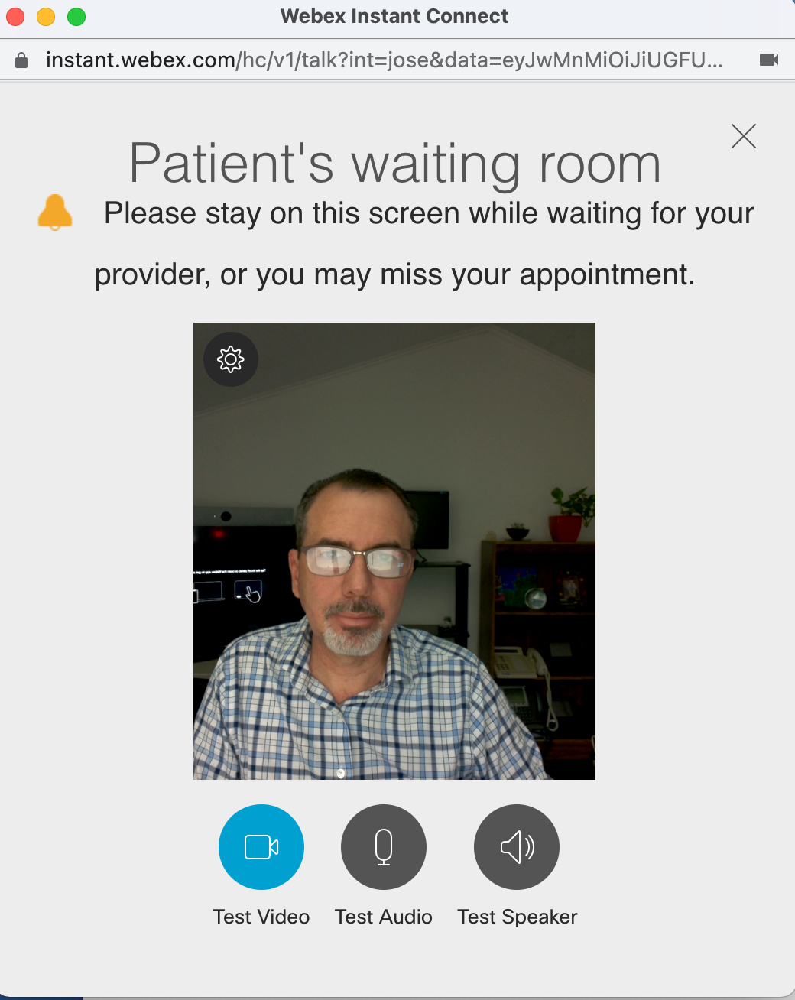
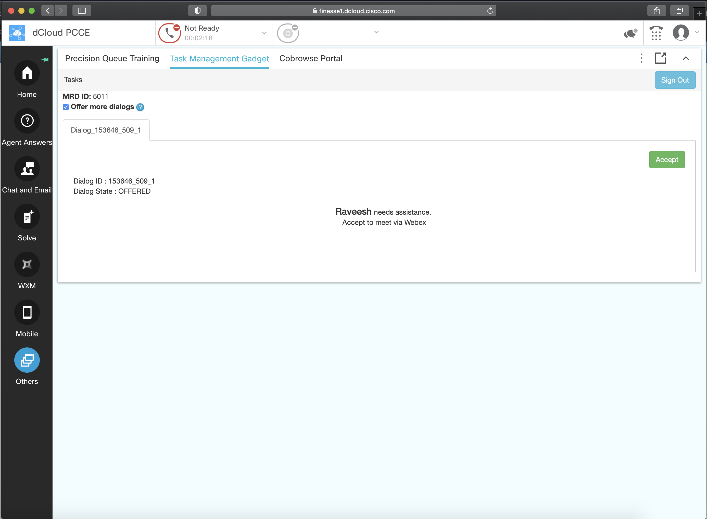
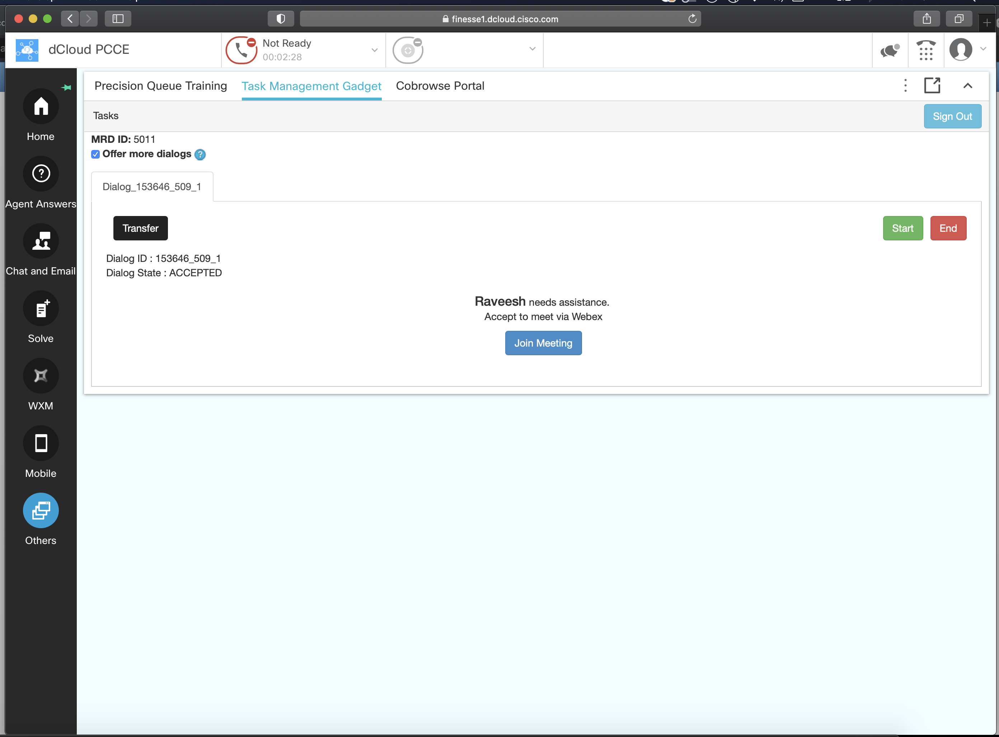

# CCE Route Webex VideoCall as Task
Sample code that uses the Cisco UCCE Task Router API to route a Webex based Video call from an end customer to an Agent


## Contacts
* Gerardo Chaves (gchaves@cisco.com)
* Raveesh Malyavantham (rmalyava@cisco.com)

## Solution Components
* Unified Contact Center Enterprise
* Webex


## Requirements
   Customer Collaboration Platform (formerly SocialMiner) integrated with Packaged CCE or Unified CCE and Finesse. The Universal Queue feature 
   is configured on SocialMiner, CCE, and Finesse.

   To actually run the Task html file, node.js and the required libraries
   must be installed.


## Prerequisites

   - Customer Collaboration Platform (formerly SocialMiner), Packaged CCE/Unifed CCE, and Finesse installed.  The Universal Queue feature
     configured (Follow the directions in the "Universal Queue" section of the "Features Guide" for Unified CCE or Packaged CCE). If you use an instance
     of the "Cisco Packaged Contact Center Enterprise (PCCE) 12.5 v2" Cisco dCloud demo, the Universal Queue feature is already configured. 
     
	 
   - The ID of the Task feed configured to process Task requests. The
     ID can be obtained using the following Customer Collaboration Platform REST API:
       http://<socialMiner>/ccp-webapp/ccp/feed

     This REST API lists XML for each feed configured on SocialMiner.
     Feeds with type 12 are task feeds. The name given when the feed was
     configured is also listed. This is the easiest way to find the XML for
     the Task feed. Here is some sample output from the feed API:

``` 
     <feeds>
       <Feed>
         <changeStamp>0</changeStamp>
         <name>Task</name>
         <pushFeedURL>http://<socialMiner>/ccp/task/feed/101212</pushFeedURL>
         <refURL>http://<socialMiner>/ccp-webapp/ccp/feed/101212</refURL>
         <status>1</status>
         <tags>
           <tag>task</tag>
         </tags>
         <type>12</type>
       </Feed>
       ...
     </feeds>
```

The ID of the feed is the number at the end of the refURL field. In this example, the ID is 101212.  
     NOTE: If you use an instance of the "Cisco Packaged Contact Center Enterprise (PCCE) 12.5 v2" Cisco dCloud demo there is
     an example Feed with Feed ID '100080' and script Selector with value 'CumulusTask' already set up. The 'consult.html' file in this sample already 
     has the proper values to use that feed from the dCloud demo configured in to variables scriptSelector and feedId in the initiateTaskRequest() function

- Webex instant connect subscription:  https://instant.webex.com/  
  NOTE: You will need to follow the process you will trigger by clicking on the "Activate Instant Connect" button on instant.webex.com using your 
organizations admin credentials to obtain the proper "Audience" string needed for the installation step below.  


-  node.js installed. It is available from this site:  
    http://nodejs.org/  


## Installation/Configuration

   Run these steps to ensure node.js has the necessary dependencies to run the
   proxy.

   - Change directory to <sample code install location>/node.
     <sample code install location> is the directory where you cloned this sample code.

   - Run the following command to install dependencies:
       npm install
       
   - At this point, node has the dependencies it needs to serve up the
     consult html page as well as proxy the Customer Collaboration Platform Task API.
     
   - Setup the following environmental variables in the .env file:  
        `IC_API_URL` is the URL for the Webex Instant Connect API (default value is https://mtg-broker-a.wbx2.com/api/v1/joseencrypt )  
        `IC_AUDIENCE` is the "Audience" string provided to you when you register to use the Instant Connect Service  
        `IC_ACCESS_TOKEN` is a valid Webex Access token from the organization you register to use Instant Connect.  
        `IC_URL_DURATION` is the the expiration time given as the number of seconds from the Unix Epoch (1970-01-01T00:00:00Z UTC) on or after which the JWT will not be accepted for processing. If not specified will be set for 15 minutes later than the time when the request was made    
        `IC_BASE_SUBJECT`  A unique value in your organization which will be used to place hosts and guests into the same collaboration space. This claim may contain only letters, numbers, and hyphens  
        `IC_AGENT_BASEURL` is the base URL to use with Instant Connect to force the user to log into Webex. We will use this for agents. Check the Instant Connect documentation for current values (default value is https://instant.webex.com/hc/v1/login?&fli=true&int=jose&data=)  
        `IC_CLIENT_BASEURL` is the base URL to use with Instant Connect to force the user to log into Webex. We will use this for agents. Check the Instant Connect documentation for current values (default value is https://instant.webex.com/hc/v1/talk?int=jose&data= )  
        `TSK_RT_BASE_HOST` is the hostname of where the node.js server of this sample will be running as perceived by the Finesse Gadget on the agent's desktop. If testing locally on your MacOS machine, 
     you can issue the command `ifconfig | grep inet` and select the IP address that corresponts to your machine within the VPN tunnel to dCloud. 
     This is so that the Finesse Gadget knows how to come back and retrieve the instant connect URLs using the temporary token generated by the code upon initiating a new task. 
     
### Connect to the dCloud instance  
Follow instructions on dCloud to VPN into your demo instance

### Enable the 3rdpartygadget account on the Finesse Server:

From a terminal window on your PC, execute the following commands: 
```
% ssh -l administrator 198.18.133.16
administrator@198.18.133.16's password: dCloud!23

Command Line Interface is starting up, please wait ...

   Welcome to the Platform Command Line Interface

VMware Installation:
	2 vCPU: Intel(R) Xeon(R) CPU E7- 2830  @ 2.13GHz
	Disk 1: 146GB, Partitions aligned
	8192 Mbytes RAM

admin:utils reset_3rdpartygadget_password
New Password: ciscocisco
Confirm New Password: ciscocisco
Updating password for 3rdpartygadget...

Password updated successfully.
admin:
```  

At this point you could type the `exit` command, but you will need to execute another command to restart the finesse server after updating the gadget so leave the connection active.  


### Upload the modified TaskManagement gadget


The following instructions are for using the [FileZilla](https://filezilla-project.org/) SFTP client to transfer the gadget from your PC to 
the Finesse server in the PCCE dCloud demo instance, but you can use any other SFTP tool and use these instructions as a reference only:  

In the quickconnect bar,  

Enter the Finesse FQDN: 198.18.133.16 in the Host field.  
Enter 3rdpartygadget in the Username field.  
Enter ciscocisco in the Password field. This is the 3rdpartygadget password defined in the previous step (ciscocisco).  
Enter 22 in the Port field.  
Click Quickconnect.  

In the remote site section, confirm that you see a folder named / and you can see the files folder below  


Transfer the updated TaskManagement gadget:

Drag the TaskManagement folder (that contains the xml, js, and css) from your local computer into the files/Cumulus folder on the 
Finesse server.  

Confirm that the transfer was successful by checking that the transfers shows up in the Successful transfers tab at the bottom.

Change the file permissions of the gadget files. The gadget files have to have public read permissions for it to be loaded on the Finesse agent desktop.

Select the TaskManagement folder.

Right-click on the TaskManagement folder.

From the dropdown menu, select File permissions....

A Change file attributes window appears.

Under Public permissions verify that Read permissions is selected.

Select Recurse into subdirectories.

Click OK.

Confirm that you can access the gadget:

Open Chrome and go to the following URL: https://198.18.133.16:8445/3rdpartygadget/files/Cumulus/TaskManagement/TaskManagementGadget.xml  

If the sample gadget was uploaded successfully, you will see content of the TaskManagementGadget.xml file in the browser window.

After making changes to the source code of a gadget it is very likely they will not be reflected 
on the Finesse desktop even after page reload, clearing browser cache and agent sign out/ sign in.  
To be sure the changes you made will be reflecetd, you must restart the finesse server using the following command 
also while connected to the Finesse server CLI:  

```
admin:utils service restart Cisco Finesse Tomcat
 Don't press Ctrl-c while the service is getting RESTARTED.If Service has not Restarted Properly, execute the same Command Again
Service Manager is running
Cisco Finesse Tomcat[STOPPING]  
Cisco Finesse Tomcat[STOPPING]  
Cisco Finesse Tomcat[STARTING]  
Cisco Finesse Tomcat[STARTING]  
Cisco Finesse Tomcat[STARTING]  
Cisco Finesse Tomcat[STARTING]  
Cisco Finesse Tomcat[STARTING]  
Cisco Finesse Tomcat[STARTED]  
Cisco Finesse Tomcat[STARTED]  
admin:

```

You also need to enable CORS on Finesse server so that the modified Task Management Gadget can obtain the Instant Connect 
URLs from our custom web server running on your laptop. While still on the Finesse Server CLI, execute the following commands 
shown after the admin: prompts below:    

```
admin:utils finesse cors enable all

Cisco Finesse CORS is enabled now.

Ensure CORS is enabled in all the Finesse nodes in the cluster.

Currently no origins are configured in allowed origins.

Ensure that origins are configured and then,

Restart Cisco Finesse Tomcat and Notification Service for the changes to take effect:
 utils service restart Cisco Finesse Tomcat
 utils service restart Cisco Finesse Notification Service

admin:utils service restart Cisco Finesse Tomcat
 Don't press Ctrl-c while the service is getting RESTARTED.If Service has not Restarted Properly, execute the same Command Again
Service Manager is running
Cisco Finesse Tomcat[STARTING]  
Cisco Finesse Tomcat[STARTING]  
Cisco Finesse Tomcat[STARTING]  
Cisco Finesse Tomcat[STARTED]  
admin:utils service restart Cisco Finesse Notification Service
 Don't press Ctrl-c while the service is getting RESTARTED.If Service has not Restarted Properly, execute the same Command Again
Service Manager is running
Cisco Finesse Notification Service[STOPPING]  
Cisco Finesse Notification Service[STARTING]  
Cisco Finesse Notification Service[STARTED]  
admin:
```


## Usage

Run these steps to use the sample and verify your deployment.
 
   - Open a terminal and change directory to <sample code install location>/node

   - Run the following command:
       node TaskProxy.js --host <socialMinerHost>  
     <socialMinerHost> is the hostname or IP address of Customer Collaboration Platform, typically 198.18.133.43 for the PCCE dCloud demo.


- On your local machine, launch the Finesse desktop for the agent: https://finesse1.dcloud.cisco.com/
Aegnt Name: Sandra Jefferson
Username: sjeffers
Password: C1sco12345
Extension: 1080

- become available for Tasks

   - Open the following URL in Firefox to simulate an customer requesting a video consultation:
       http://localhost:8080/consult.html
     Port 8080 is the default setting for API_PROXY_LISTEN_PORT in TaskProxy.js.
     If you changed API_PROXY_LISTEN_PORT, use the new setting in the URL.

   - Enter a the customer's name

   - Click "Submit Task".

   - If everything is configured properly, the UI displays the message
     "Finding the right agent for your request." and a separate browser window for the customer side of the Webex Instant Connect based video consultation will open.  
     NOTE: At the moment the text in the window refers to the customer as the "Patient" and the customer service agent as the "Physician". In a future version of Instant Connect  
     these strings will be configurable so we will be able to adjust them to the proper context of a video call in an retail or transportation environment. 
     


   - The UI displays the estimated wait time, if configured.

   - When an agent is found, the UI displays the message "Agent found for your request.

   - On the agent side, first be sure to have the Finesse desktop web interface open and then, click on the Task Management Finesse gadget and click on Sign In  

   - Become available for Task Management by using the dropdown on the upper center part of the screen to the right of the green Ready icon with the other media you can select.

   - Once you are available, the task you submitted with the from the ```consult.html``` page will appear for the agent to accept. 
    


   - After clicking on the "Accept" button, the agent will be offered a button to join a meeting with the customer:  
  
     
  
   - Now click on the "Join Meeting" button within the Task Routing Finesse Gadget to start the consultation. This button will open another tab 
on the browser with the Instant Connect interface for the Agent to join the video consultation.   

# Screenshots


### LICENSE

Provided under Cisco Sample Code License, for details see [LICENSE](LICENSE.md)

### CODE_OF_CONDUCT

Our code of conduct is available [here](CODE_OF_CONDUCT.md)

### CONTRIBUTING

See our contributing guidelines [here](CONTRIBUTING.md)

#### DISCLAIMER:
<b>Please note:</b> This script is meant for demo purposes only. All tools/ scripts in this repo are released for use "AS IS" without any warranties of any kind, including, but not limited to their installation, use, or performance. Any use of these scripts and tools is at your own risk. There is no guarantee that they have been through thorough testing in a comparable environment and we are not responsible for any damage or data loss incurred with their use.
You are responsible for reviewing and testing any scripts you run thoroughly before use in any non-testing environment.